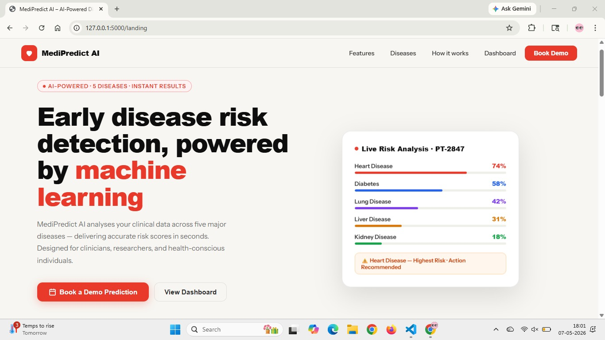
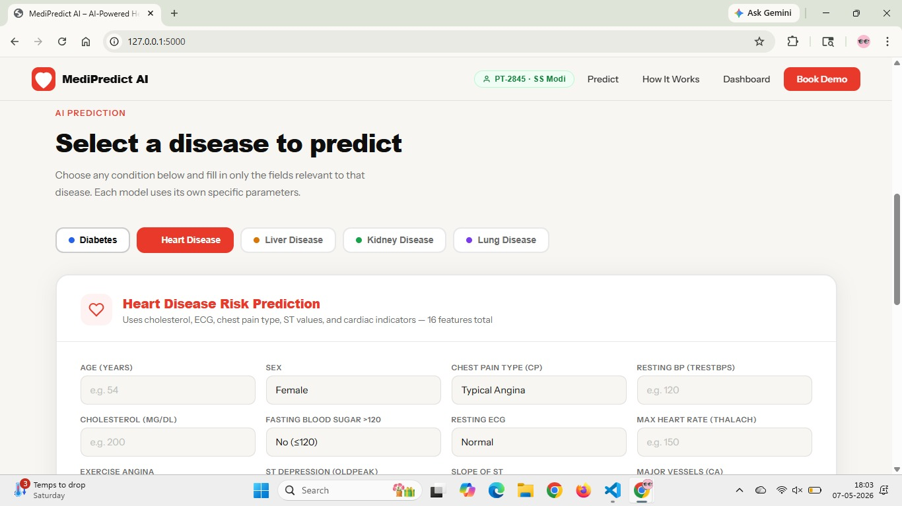
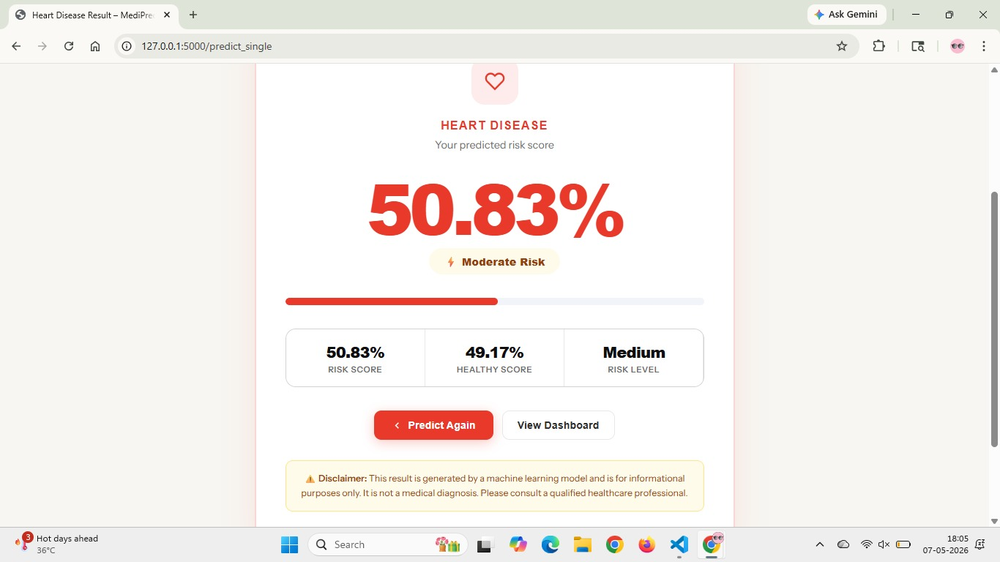
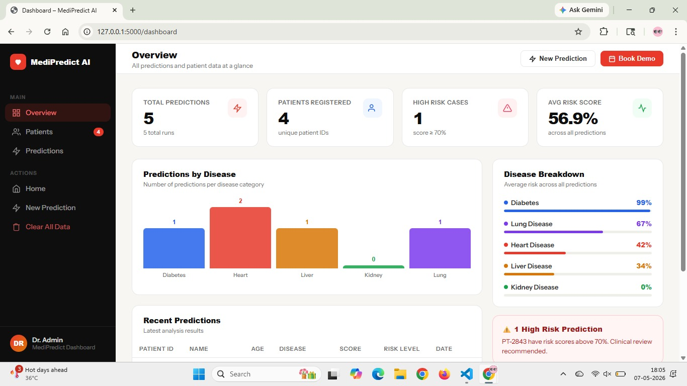
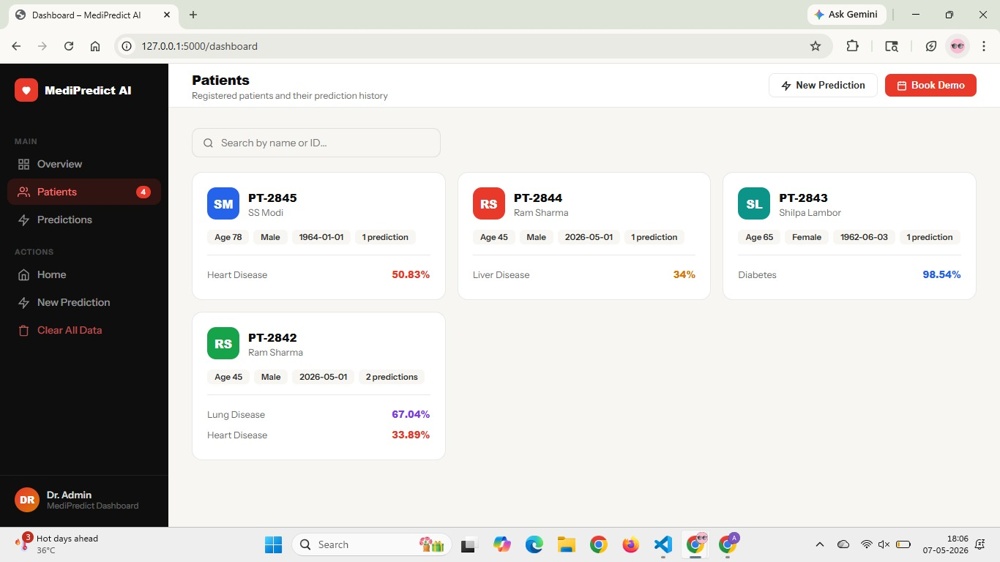

# 🩺 MediPredict AI – Multi-Disease Prediction System

MediPredict AI is a Flask-based Machine Learning web application designed to predict the risk of multiple diseases using patient clinical data and trained AI models.

The system currently supports prediction for:

- Diabetes
- Heart Disease
- Liver Disease
- Kidney Disease
- Lung Disease

The application provides an interactive healthcare dashboard, patient management interface, and real-time disease risk analysis using Machine Learning models.

---

# 🚀 Features

✅ Multi-disease prediction system  
✅ Interactive and responsive UI  
✅ Individual disease prediction modules  
✅ AI-powered probability score generation  
✅ Patient dashboard and analytics  
✅ Disease-wise prediction visualization  
✅ Risk-level categorization  
✅ Flask-based backend integration  
✅ Machine Learning model deployment using Pickle  

---

# 🧠 Supported Diseases

| Disease | Status |
|---|---|
| Diabetes Prediction | ✅ |
| Heart Disease Prediction | ✅ |
| Liver Disease Prediction | ✅ |
| Kidney Disease Prediction | ✅ |
| Lung Disease Prediction | ✅ |

---

# 🛠️ Tech Stack

## Frontend
- HTML5
- CSS3
- JavaScript

## Backend
- Python
- Flask

## Machine Learning
- Scikit-learn
- NumPy
- Pickle

## Development Tools
- VS Code
- Git
- GitHub

---

# 📂 Project Structure

```plaintext
AI_Disease_Detection/
│
├── datasets/
│   ├── Diabetes_Dataset.xlsx
│   ├── Liver_Dataset (1).csv
│   └── lung_disease_data.csv
│
├── models/
│   ├── diabetes_model.pkl
│   ├── diabetes_scaler.pkl
│   ├── heart_model.pkl
│   ├── heart_scaler.pkl
│   ├── kidney_model.pkl
│   ├── kidney_scaler.pkl
│   ├── liver_model.pkl
│   ├── liver_scaler.pkl
│   ├── lung_model.pkl
│   └── lung_scaler.pkl
│
├── templates/
│   ├── dashboard.html
│   ├── index.html
│   ├── landing.html
│   ├── result.html
│   └── result_single.html
│
├── app.py
└── README.md
```

---

# ⚙️ Installation & Setup

## 1️⃣ Clone the Repository

```bash
git clone https://github.com/AnviSharma04/AI_Disease_Detection.git
```

---

## 2️⃣ Navigate to Project Folder

```bash
cd AI_Disease_Detection
```

---

## 3️⃣ Install Required Dependencies

```bash
pip install flask numpy scikit-learn
```

---

## 4️⃣ Run the Flask Application

```bash
python app.py
```

---

## 5️⃣ Open in Browser

```plaintext
http://127.0.0.1:5000/
```

---

# 🧠 Machine Learning Models :

The project uses pre-trained Machine Learning models stored as `.pkl` files.

Each disease module contains:

- Prediction Model
- Feature Scaler

The models are loaded dynamically using Python Pickle.

Example:

```python
diabetes_model  = load_file("diabetes_model.pkl")
diabetes_scaler = load_file("diabetes_scaler.pkl")
```

---

# 📊 Prediction Modules

## Diabetes Prediction
Uses parameters such as:
- Glucose Level
- BMI
- Blood Pressure
- Insulin
- HbA1c
- Family History
- Physical Activity

---

## Heart Disease Prediction
Uses:
- Cholesterol
- ECG Results
- Chest Pain Type
- Heart Rate
- Blood Pressure
- BMI
- Smoking History

---

## Liver Disease Prediction
Uses:
- Bilirubin Levels
- Albumin
- Protein Levels
- Alkaline Phosphotase
- Aminotransferase Values

---

## Kidney Disease Prediction
Uses:
- Creatinine
- Urea
- Blood Pressure
- Albumin

---

## Lung Disease Prediction
Uses:
- Lung Capacity
- Smoking Status
- Hospital Visits
- Disease Type
- Treatment Type

---

# 🖥️ Application Pages

## 🏠 Landing Page
Displays the introduction and overview of the MediPredict AI platform.

Features:
- Disease overview
- AI-powered healthcare presentation
- Navigation dashboard

---

## 📋 Prediction Interface
Users can:
- Select a disease
- Enter clinical data
- Generate AI-based predictions

Each disease contains a separate input form with disease-specific parameters.

---

## 📈 Result Page
Displays:
- Prediction percentage
- Risk category
- Healthy score
- AI-generated disease risk analysis

---

## 📊 Dashboard
Includes:
- Total predictions
- High-risk cases
- Average risk score
- Disease breakdown charts
- Recent predictions

---

## 👥 Patient Management
Stores and displays:
- Patient IDs
- Prediction history
- Disease records
- Risk scores

---

# 🔄 Flask Routes

| Route | Description |
|---|---|
| `/landing` | Landing Page |
| `/` | Main Prediction Page |
| `/dashboard` | Analytics Dashboard |
| `/predict` | Predict all diseases |
| `/predict_single` | Predict selected disease |

---

# 📌 Core Functionalities

- Dynamic disease prediction
- Multi-model integration
- Real-time risk analysis
- Form-based clinical data collection
- Dashboard analytics visualization
- Patient record interface

---

# 📷 Application Screenshots

---

## 🏠 Landing Page



---

## 📋 Disease Prediction Interface



---

## 📈 Prediction Result Page



---

## 📊 Analytics Dashboard



---

## 👥 Patient Management System




---

# 🔮 Future Improvements

- Database integration
- User authentication system
- Cloud deployment
- Medical report PDF export
- Deep Learning integration
- Real-time hospital API integration
- Mobile responsive optimization

---

# ⚠️ Disclaimer

This application is developed for educational and research purposes only.

The prediction results generated by the system are based on Machine Learning models and should not be considered professional medical advice or diagnosis.

Always consult qualified healthcare professionals for medical decisions.

---

# 👨‍💻 Contributors

- Anvi Sharma
- Anuj Bhandwalkar
- Anushka Kalbhor
- Anuradha Sawant
- Gayatri Aradhye

---

# 📚 Learning Outcomes

This project demonstrates:
- Flask web development
- Machine Learning deployment
- Healthcare data analysis
- Predictive analytics
- Frontend-backend integration
- AI model integration using Pickle

---


# 📄 License

This project is intended for academic and educational purposes.
